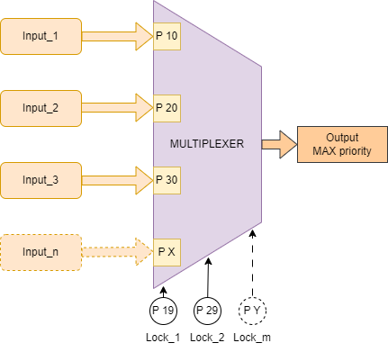
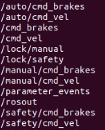

## Description
This library for ROS2 Humble is a tool designed to manage an prioritize the publishing of messages on topics based on their priority. This is achieved using multiplexers that take as input any number of topics with the same message type and filters them to output the published topic with the highest priority.



## Features
### Multiplexing based on priority
The library allows the creation of multiple multiplexers, each dedicated to a specific type of ROS2 message. 
Each multiplexer reads from several input topics, each associated with a priority level. The input with the highest priority is selected and forwarded to the output topic.

At the moment this library only supports Twist (geometry_msgs/msg/Twist) and Float64 messages (std_msgs/msg/Float64) for the inputs and output. To add another type of message the code must be modified to include a callback function for that type:

```c++
void NewTypeTopicCallback(const new_type::SharedPtr msg, const std::string& topic, const std::string& mux_name);
```

The variant variables must be modified aswell to include the new type of message:

```c++
std::variant<std::monostate, geometry_msgs::msg::Twist, std_msgs::msg::Float64, new_type>
```

### Configurable Locks
The multiplexers include locks to prevent the pass of low priority messages once the high priority topic stopped publishing.
This locks are special topics of type bool (std_msgs/msg/Bool) that have a priority. Once the lock is set to True (no need for continuous publishing) all inputs with a lower priority are disabled.
To release the lock a "False" must be published on that topic.
This acts as a safety mecanism to ensure that the release is voluntary.

### Configurable behavior via YAML files:
The configuration of the multiplexers is done via YAML file. There are two files:
- **locks_config.yaml**: Defines the available locks, each associated witha a topic and a priority
- **multiplexer_config.yaml**: Defines the multiplexers, including their output topic, input topics, priorities, message type and the frequency at which the output is published.

### How to build and run the package

```bash
  cd ros2_workspace/
  colcon build --packages-select multiplexer_node
  source install/setup.bash
  ros2 run multiplexer_node multiplexer_node
```
This should create a list of topics like this:
```bash
  ros2 topic list
```
